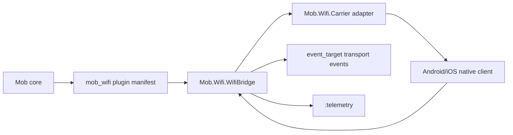

# mob_wifi

`mob_wifi` is the production WiFi transport plugin for `mob`.

The current release establishes the package boundary, plugin manifest, carrier
policy, configuration validation, bridge lifecycle, telemetry surface, and
carrier adapter contract. Native Android and iOS implementations are
intentionally deferred until the hardware validation matrix confirms the final
carrier split.

## Architecture



`Mob.Wifi.WifiBridge` owns Mob-facing lifecycle, policy enforcement, event
normalization, and telemetry. Carrier adapters own platform-specific discovery
and frame delivery.

## Carrier Matrix

| Carrier | Platforms | Status | Strengths | Limitations |
| --- | --- | --- | --- | --- |
| `:wifi_direct` | Android-to-Android | Initial bridge carrier | Infrastructure-free peer links, good bandwidth | Android-only, group negotiation and permissions need validation |
| `:multipeer` | iOS-to-iOS | Planned | Apple-supported nearby discovery/session API | Not an Android interop layer |
| `:bonjour_tcp` | Android/iOS | Planned | Best cross-platform control once IP topology exists | Needs shared network/hotspot topology and reliability layer |
| `:wifi_aware` | Android | Deferred | Promising discovery and ranging model | Requires separate feature detection and hardware evidence |

`Mob.Wifi.WifiBridge` only starts with `:wifi_direct` today. Other recognized
carriers are documented and accepted at manifest/config level, but rejected by
the bridge until native implementations exist.

See `docs/CARRIER_DECISION.md` for the full carrier policy.

## Usage

```elixir
config :mob_wifi, config: [
  carrier: :wifi_direct,
  platform: :android,
  mode: :production,
  max_frame_bytes: 262_144
]
```

```elixir
{:ok, bridge} =
  Mob.Wifi.bridge_module().start_link(
    event_target: self(),
    native_client: MyNativeWifiClient
  )

:ok = Mob.Wifi.WifiBridge.send_frame(bridge, "peer-1", <<1, 2, 3>>)
```

Bridge events are delivered to the configured `:event_target`:

```elixir
receive do
  {:transport_up, peer_id, metadata} ->
    {:peer_available, peer_id, metadata}

  {:frame, peer_id, frame} ->
    {:received, peer_id, frame}

  {:transport_down, peer_id} ->
    {:peer_unavailable, peer_id}

  {:transport_error, reason} ->
    {:wifi_error, reason}
end
```

Graceful shutdown uses the normal GenServer lifecycle:

```elixir
Mob.Wifi.WifiBridge.stop(bridge)
```

## Telemetry

The bridge emits low-cardinality telemetry events:

- `[:mob_wifi, :bridge, :started]`
- `[:mob_wifi, :bridge, :stopped]`
- `[:mob_wifi, :frame, :sent]`
- `[:mob_wifi, :frame, :send_error]`
- `[:mob_wifi, :frame, :received]`
- `[:mob_wifi, :peer, :up]`
- `[:mob_wifi, :peer, :down]`
- `[:mob_wifi, :bridge, :error]`

## Roadmap

1. Prototype Bonjour/TCP discovery and connection management.
2. Add Android WiFi Direct native adapter.
3. Add iOS Multipeer native adapter.
4. Define reliability semantics for sequencing, ACKs, and retransmission.
5. Integrate Mob identity and frame encryption requirements.
6. Publish to Hex once the public API stabilizes.

## Configuration

Configuration is validated with NimbleOptions. `:mode` controls runtime
strictness:

- `:production` keeps strict carrier policy and conservative defaults.
- `:test` is for hardware validation and may use shorter retry intervals.
- `:simulation` is for non-native local development.

The older `:evidence_mode` key remains accepted as a compatibility alias.

## Validation

```bash
mix format --check-formatted
mix test
```

Additional docs:

- `docs/CARRIER_IMPLEMENTATION.md`
- `docs/PERFORMANCE.md`
- `docs/PLUGIN_LOADING.md`
- `docs/SECURITY.md`
- `docs/TESTING.md`
